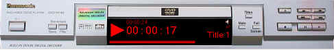



## Stu's DVD Player

### Description

This Code will Play, Stop, Pause, Cue Fwd (2,4,8 Speed) and Cue Reverse (1,2,4,8 speed). Enable/Disable Subtitles, Select Subtitle Language, DVD Progress bar, Current play time, total Playtime display, Bookmark, Mute and Next/Previouse Chapter Play - Direct X 8 must be installed, also the graphics for the DVD player are set up for 1024x768 display, thus any resolution lower than this will not display the whole player. I will add to the program so lower resolutions can use it fully.
 
### More Info
 

             |
---                |---
**Submitted On**   |2001-01-02 23:32:14
**By**             |[STUART LISHMAN](https://github.com/Planet-Source-Code/PSCIndex/blob/master/ByAuthor/stuart-lishman.md)
**Level**          |Intermediate
**User Rating**    |4.2 (46 globes from 11 users)
**Compatibility**  |VB 6\.0
**Category**       |[Complete Applications](https://github.com/Planet-Source-Code/PSCIndex/blob/master/ByCategory/complete-applications__1-27.md)
**World**          |[Visual Basic](https://github.com/Planet-Source-Code/PSCIndex/blob/master/ByWorld/visual-basic.md)
**Archive File**   |[CODE\_UPLOAD13300122001\.zip](https://github.com/Planet-Source-Code/stuart-lishman-stu-s-dvd-player__1-14059/archive/master.zip)

